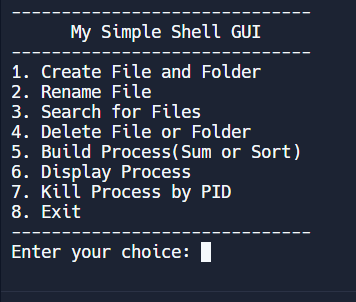

# Simple Shell Base GUI | Linux

This **Bash script** provides a simple **shell-based GUI** for performing various file and process operations in Linux. It demonstrates core **Bash scripting** techniques and allows users to interact with the system through a text interface for tasks such as file management, process handling, and basic calculations.

---

## 🚀 Features

* **File and Folder Operations**: Create, rename, delete files and directories.
* **Process Management**: Display running processes, kill processes by PID.
* **File Search**: Search for files within a given directory.
* **Mathematical Operations**: Perform simple arithmetic and sorting operations.
* **User-Friendly Interface**: Simple menu-driven interface with clear feedback and error handling.

---

## 🛠 Technologies Used

* **Bash** – Scripting language.
* **Linux/Unix-based Operating Systems** – The script is designed to run on Linux or macOS.

---

## 📸 Screenshot

---

## 📈 Learning

In this project, you will learn:

* **Bash scripting fundamentals**, including defining functions and handling user input.
* **File and process management** using Bash commands.
* **Error handling** in Bash and providing clear feedback to the user.
* **Basic system operations** such as process listing, killing processes, and performing arithmetic operations.
